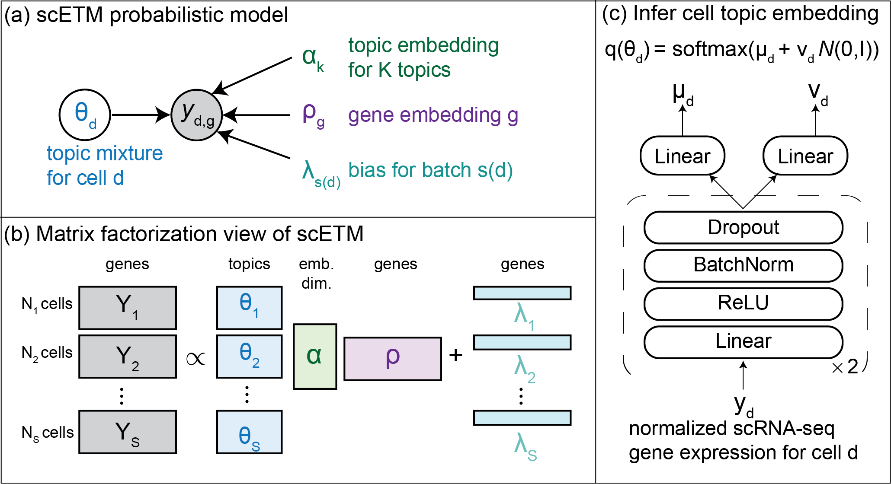

# scETM: single-cell Embedded Topic Model
A generative topic model that facilitates integrative analysis of large-scale single-cell RNA sequencing data.

The full description of scETM and its application on published single cell RNA-seq datasets are available in ... (to be added once on bioarxiv).

This repository includes detailed instructions for installation and requirements, demos, and scripts used for the benchmarking of 7 other state-of-art methods.


## Contents ##

- [scETM: single-cell Embedded Topic Model](#scetm-single-cell-embedded-topic-model)
  - [Contents](#contents)
  - [1 Model Overview](#1-model-overview)
  - [2 Installation](#2-installation)
  - [3 Usage](#3-usage)
    - [Required data](#required-data)
    - [Example usage](#example-usage)
  - [4 Benchmarking](#4-benchmarking)
    - [Data simulation](#data-simulation)
    - [Running baseline methods](#running-baseline-methods)


<a name="overview"></a>
## 1 Model Overview


**(a)** Probabilistic graphical model of scETM. We model the scRNA-profile read count matrix y<sub>d,g</sub> in cell d and gene g across S subjects or studies by a multinomial distribution with the rate parameterized by cell topic mixture θ, topic embedding α, gene embedding ρ, and batch effects λ. **(b)** Matrix factorization view of scETM. **(c)** Encoder architecture for inferring the cell topic mixture θ.

<a name="installation"></a>
## 2 Installation
Python version: 3.7+
After cloning this repository, the required packages may be installed by:
```
cd scETM
pip install -r requirements.txt
```

<a name="usage"></a>
## 3 Usage

<a name="data"></a>
### Required data
scETM requires a cells-by-genes matrix as input, in the format of an AnnData object. Detailed description about AnnData can be found [here](https://anndata.readthedocs.io/en/latest/).

Note that the evaluation script requires the input to have following fields in the AnnData.obs: 'batch_indices','cell_types'

<a name="usage"></a>
### usage
An introductory tutorial can be found in [here](/notebooks/scETM%20introductory%20tutorial.ipynb). 
There are two flavors, scETM and pathway-informed scETM (p-scETM). The difference is that, in p-scETM, the gene embedding \rho is fixed to a pathways-by-genes matrix, which can be downloaded from the [pathDIP4 pathway database](http://ophid.utoronto.ca/pathDIP/Download.jsp). We only keep pathways that contain more than 5 genes. 

1. scETM
```bash
$ python train.py \
 --model scETM \
 --norm-cells \
 --batch-scaling \
 --h5ad-path data/MousePancreas.h5ad \
 --n-epochs 800 \
 --log-every 400 \
 --ckpt-dir results/ \
 --save-embeddings
```

2. p-scETM
The gene-by-pathway matrix (with row and column names) is stored in a csv file specified by the "pathway-csv-path" argument. The gene names in the gene-by-pathway matrix must correspond to those in the scRNA-seq data for the program to merge the two sources. If it is desired to fix the gene embedding matrix $\rho$ during training, let "trainable-gene-emb-dim" be zero. In this case, the gene set used to train the model would be the intersection of the genes in the scRNA-seq data and the genes in the gene-by-pathway matrix. Otherwise, if "trainable-gene-emb-dim" is set to a positive value, all the genes in the scRNA-seq data would be kept.
```bash
$ python train.py \
 --model scETM \
 --norm-cells \
 --batch-scaling \
 --h5ad-path data/HumanPancreas.h5ad \
 --pathway-csv-path data/pathdipv4_morethan5.csv \
 --n-epochs 800 \
 --log-every 400 \
 --ckpt-dir results/ \
 --save-embeddings \
 --trainable-gene-emb-dim 0  # fixing the gene embedding \rho
```

<a name="benchmarking"></a>
## 4 Benchmarking
The commands used for running [Harmony](https://github.com/immunogenomics/harmony), [Scanorama](https://github.com/brianhie/scanorama), [Seurat](https://satijalab.org/seurat/), [scVAE-GM](https://github.com/scvae/scvae), [scVI](https://github.com/YosefLab/scvi-tools), [LIGER](https://macoskolab.github.io/liger/), [scVI-LD](https://www.biorxiv.org/content/10.1101/737601v1.full.pdf) are available in the [baselines](/baselines) folder.
